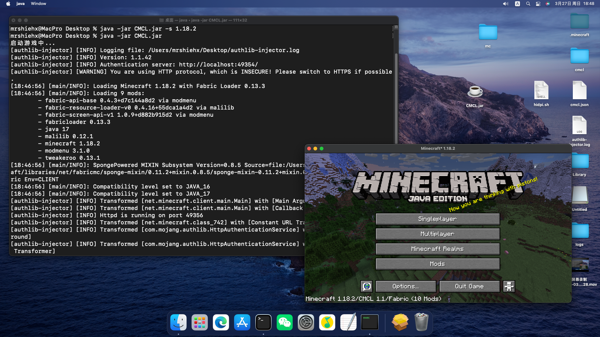

# Console Minecraft Launcher
A Launcher for Minecraft Java Edition Running On The Console

[点我转到中文的README页面](https://github.com/MrShieh-X/console-minecraft-launcher/blob/master/README-zh.md)  
[Click me to go to the update log of this program](https://github.com/MrShieh-X/console-minecraft-launcher/blob/master/update_logs.md)  

## Copyright
MrShiehX owns the copyright of this program. 
Anyone can take advices of this program to me.

## Version
The latest version:  
<b>1.0 (Mar. 12, 2022)</b> 
Historical version:  
<b>1.0 (Mar. 12, 2022) (First version)</b> 

## License
The software is distributed under [GPL v3](https://www.gnu.org/licenses/gpl-3.0.html) with additional terms.

### Additional terms under GPLv3 Section 7
You must <b>not</b> remove the copyright declaration displayed in the software. (under GPLv3, 7(b).)

## Software Configuration Required for This Program
* Java 8 or higher

## Supported Languages
- English
- Simplified Chinese

## Program Screenshot
 

## Configurations
The configurations are storing in a JSON file named cmcl.json, you can edit them by a file editor (need to know JSON tutorial) or the program arguments `-config -s -t <Configuration Type> -n <Configuration Name> -v <Configuration Value>` (see [Usage Manual Configuration Related](#configuration-related)). 
If you edit configurations by a file editor, only strings need double quotation mark, otherwise, other types do not need it. 
If you edit by the program arguments, note that if there are spaces in the string, double quotation marks must be added, otherwise it can be added or not.

| Configuration|Type|Meaning|
| -----|:----:|:----:|
| playerName|String|Player Name|
| loginMethod|Integer|Account type, 0 is offline, 2 is Microsoft account|
| accessToken|String|Official account related|
| uuid|String|Official account related|
| tokenType|String|Official account related, the type of token|
| language|String|Language, zh is Simplified Chinese and en is English|
| maxMemory|Integer|Maximum (Unit: MB)|
| gameDir|String|Custom the path of the game directory, default is .minecraft|
| assetsDir|String|Custom assets resource directory path, if empty, it is the assets directory in the game directory|
| resourcesDir|String|Custom resource pack directory path, if empty, it is the resourcepacks directory in the game directory|
| javaPath|String|Java Path (It will get automatically if it is empty)|
| selectedVersion|String|Selected start version|
| windowSizeWidth|Integer|The width of the game window|
| windowSizeHeight|Integer|The height of the game window|
| isFullscreen|Boolean|Whether it is full screen, true if yes, false otherwise|
| exitWithMinecraft|Boolean|When running the game, if you need to exit the program and exit the game by the way, it is true, otherwise it is false|

## Usage Manual
&emsp;&emsp;Print usage manual:&emsp;&emsp;&emsp;&emsp;&emsp;&emsp;&emsp;&ensp;`-u` 
&emsp;&emsp;Start the selected version:&emsp;&emsp;&emsp;&emsp;&emsp;Direct start game without parameters or `-b` 
&emsp;&emsp;Start a specific version:&emsp;&emsp;&emsp;&emsp;&emsp;&emsp;   Unique parameter: `<Version Name>` or `-b <Version Name>` 
&emsp;&emsp;List all versions:&emsp;&emsp;&emsp;&emsp;&emsp;&emsp;&emsp;&emsp;&ensp;&ensp;&ensp;`-l` 
&emsp;&emsp;List all versions in another game dir:&ensp;`-l <Target Game Directory>` 
&emsp;&emsp;Print the launch command:&ensp;&ensp;&ensp;&ensp;&ensp;&ensp;&ensp;&ensp;&ensp;`-p <Version Name>` 
&emsp;&emsp;Select version:&ensp;&emsp;&emsp;&emsp;&emsp;&emsp;&emsp;&emsp;&emsp;&emsp;&ensp;`-s <Version Name>` 
&emsp;&emsp;Get about description:&emsp;&emsp;&emsp;&emsp;&emsp;&ensp;&ensp;&ensp; `-a` 

### Configuration Related
&emsp;&emsp;Print a configuration:&emsp;&ensp;`-config -p <Configuration Name>` 
&emsp;&emsp;Print all configurations:&ensp;`-config -a` 
&emsp;&emsp;Clear all configurations: `-config -c` 
&emsp;&emsp;Remove a configuration:`-config -r <Configuration Name>` 
&emsp;&emsp;Set a configuration:&emsp;&emsp;  `-config -s -t <Configuration type, such as` 
&emsp;&emsp;&emsp;&emsp;&emsp;&emsp;&emsp;&emsp;&emsp;&emsp;&emsp;&emsp;&emsp;&emsp;&emsp;&emsp;&emsp;&emsp;&emsp;&emsp;&emsp;&emsp;`i Integer,` 
&emsp;&emsp;&emsp;&emsp;&emsp;&emsp;&emsp;&emsp;&emsp;&emsp;&emsp;&emsp;&emsp;&emsp;&emsp;&emsp;&emsp;&emsp;&emsp;&emsp;&emsp;&emsp;`b Boolean,` 
&emsp;&emsp;&emsp;&emsp;&emsp;&emsp;&emsp;&emsp;&emsp;&emsp;&emsp;&emsp;&emsp;&emsp;&emsp;&emsp;&emsp;&emsp;&emsp;&emsp;&emsp;&emsp;`s String and` 
&emsp;&emsp;&emsp;&emsp;&emsp;&emsp;&emsp;&emsp;&emsp;&emsp;&emsp;&emsp;&emsp;&emsp;&emsp;&emsp;&emsp;&emsp;&emsp;&emsp;&emsp;&emsp;`f Fraction> -n <Configuration Name> -v <Configuration Value>` 
### Account Related
&emsp;&emsp;Logout:&emsp;&emsp;&emsp;&emsp;&emsp;&emsp;&emsp;&ensp;`-account -t` 
&emsp;&emsp;Offline login:&emsp;&emsp;&emsp;&emsp;&emsp; `-account -l -o <Offline Account Name>` 
&emsp;&emsp;Login Microsoft account:`-account -l -m` 
&emsp;&emsp;Refresh official account: `-account -r` 
&emsp;&emsp;Download skin:&emsp;&emsp;&emsp;&emsp; `-account -s -d <Skin File Storage Path>` 
### Version Related
&emsp;&emsp;Delete a version:&emsp;&emsp;&emsp;&emsp;`-version -d <Version Name>` 
&emsp;&emsp;Rename a version:&emsp;&emsp;&emsp;`-version -r <Version Name> -t <New Version Name>` 
&emsp;&emsp;Re-download the native dependency library files:&emsp;&ensp;`-version -n <Version Name>` 
&emsp;&emsp;Find missing dependency library files and download:`-version -l <Version Name>` 
### Installation Version Related
&emsp;&emsp;Direct install version: `-install <Version Name (if there are spaces, add double quotes)> -n <Local Version Name>` 
&emsp;&emsp;Optional parameters:`-t <Thread Count>` Set the number of threads for downloading asset files (default 10) 
&emsp;&emsp;&emsp;&emsp;&emsp;&emsp;&emsp;&emsp;`-na` Do not download asset files 
&emsp;&emsp;&emsp;&emsp;&emsp;&emsp;&emsp;&emsp;`-nl` Do not download dependency library files 
&emsp;&emsp;&emsp;&emsp;&emsp;&emsp;&emsp;&emsp;`-nn` Do not download native dependency library files 

&emsp;&emsp;Show installable versions (if no range is set, all versions of this type are showed by default)：`-install -s <Versions types: a All; r Releases; s Snapshots; oa Ancient Alpha; ob Ancient Beta>` 
&emsp;&emsp;  Set time range (optional): `-i <from year>-<from month>-<from day>/<to year>-<to month>-<to day>` 
&emsp;&emsp;&emsp;&emsp;&emsp;&emsp;&emsp;&emsp;&emsp; Example: `-i 2020-05-09/2021-10-23` 

## About Author
MrShiehX 
- Occupation:  
  Student 
- Email address:  
  3553413882@qq.com 
- QQ: 
  3553413882 (Remember to tell me why you want to add me) 
- Bilibili: 
  [@MrShiehX](https://space.bilibili.com/323674091)  

## If you find any bugs in this program or have new ideas, please send an email or add my QQ.
