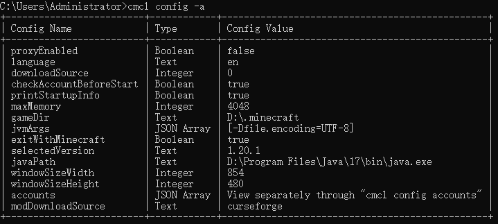

# Update Logs
Currently, the latest version is 2.2, which was updated on July 13, 2023.

## 2.2 (Jul. 13, 2023)
- Solved the problem reported by [Wst-04d12](https://github.com/Wst-04d12) in [Issue#29](https://github.com/MrShieh-X/console-minecraft-launcher/issues/29 ) and **support the new function Quick Play of 1.20**, use this function by setting the following configuration.

| Configuration Name | Type | Meaning                                                                                                                                                                                                                                                           |
|--------------------|------|-------------------------------------------------------------------------------------------------------------------------------------------------------------------------------------------------------------------------------------------------------------------|
| qpLogFile          | Text | [**Game related**] The log file path (relative to the game directory) of Quick Play (a new feature of Minecraft 1.20, set the following three configurations to start the game and directly enter the save, server or realms, only one item can be set), optional |
| qpSaveName         | Text | [**Game related**] The name of the save that the quick play will join directly                                                                                                                                                                                    |
| qpServerAddress    | Text | [**Game related**] The address (including port) of the server that the quick play will join directly, this configuration also applies to versions prior to 1.20                                                                                                   |
| qpRealmsID         | Text | [**Game related**] The ID of the realms that the quick play will join directly                                                                                                                                                                                    |

- It will be **more visually** when displaying multiple game versions, mod loader versions, etc., and will **adapt to the size of the command line window**, as shown below (by [Dage-Hoo](https://github.com/Dage-Hoo) in [Issue#28](https://github.com/MrShieh-X/console-minecraft-launcher/issues/28)).  
   
- When printing the accounts via `cmcl account -l` and printing the configurations via `cmcl config -a` and `cmcl config -v`, it will be printed in **table format**, as shown in the figure below.  
   
- For some commands that may be entered frequently, such as switching the download source `cmcl config downloadSource <download source>`,
switching the proxy `cmcl config proxyEnabled true/false`, you can set the simplified command through
`cmcl simplify -s <Simplified Command> "<Original Command>"`, for example: after entering the command
`cmcl simplify -s pon "config proxyEnabled true"`, enter the command `cmcl pon` to quickly start the proxy.
But be careful not to conflict with existing options and local version names. Get additional usage via `cmcl simplify -h`.
Combined with the actual usage of users, it is recommended to set the following simplified commands:

| Simplified command (can be set freely) | Original command          | Meaning                             |
|----------------------------------------|---------------------------|-------------------------------------|
| ds0                                    | config downloadSource 0   | Set the download source to official |
| ds1                                    | config downloadSource 1   | Set the download source to BMCLAPI  |
| ds2                                    | config downloadSource 2   | Set the download source to MCBBS    |
| pon                                    | config proxyEnabled true  | Enable proxy                        |
| poff                                   | config proxyEnabled false | Disable proxy                       |
| als                                    | account --list            | List all accounts                   |
| sr                                     | install --show=r          | List all available release versions |
| ar                                     | account -r                | Refresh the current login account   |

- **Icon URL** and **Download Count** will be included in the mods and modpacks information (by [Shapaper](https://github.com/Shapaper) in [Issue#33](https://github.com/MrShieh-X/console-minecraft-launcher/issues/33)).
- When downloading mods and modpacks, if there is already a file with the same name in the mods directory, you will be asked whether to overwrite the target file, store it in another directory or cancel the download.
- Fixed **unable to start some versions**.
- Changed the word "string" to "text".

## 2.1.4 (May 21, 2023)
- You can enable or disable the proxy by setting the configuration `proxyEnabled` to `true` or `false`. When a network error occurs, if the proxy is enabled, the user will be prompted to confirm whether the proxy is available.
- Multi-threaded download files (assets, mod files of modpacks) will output the log after a single file is successfully downloaded, and will display the number of downloaded files and the total number of files to be downloaded.
- Changed the way to choose the mod download source.

## 2.1.3 (Apr. 1, 2023)
- Fixed some issues.

## 2.1.2 (Apr. 1, 2023)
- Fixed issue raised by [Butterblock233](https://github.com/Butterblock233) on [Issue#26](https://github.com/MrShieh-X/console-minecraft-launcher/issues/26).

## 2.1.1 (Feb. 26, 2023)
- The version of Fabric API can be specified after the installation option `--api`.
- Enhanced compatibility with versions installed by other launchers.
- Fixed the problem that the startup command cannot be printed by `cmcl -p`.
- Same as Linux, will read `~/.config/cmcl/cmcl.json` as the configuration file by default under macOS
- Under Linux and macOS, the working directory of CMCL is changed from the `.cmcl` folder under the directory where CMCL is located to the `.cmcl` folder under the user directory.

## 2.1 (Feb. 12, 2023)
- Optimized the startup speed of the launcher.
- Version-related operations (version) may not be followed by the version to operate the selected version, such as `cmcl version --fabric --api`.
- Version isolation can be set and unset via `version [<version>] --isolate` and `version [<version>] --unset-isolate`.
- The startup command of the version can be printed by `version [<version>] -p` or `version [<version>] --print-command`.
- You can export the startup script via `version [<version>] --export-script=<script file>`, or `version [<version>] --export-script-ps=<script file>` in PowerShell format.
- The original startup command printing options `-p` and `--print` can not be followed by the version, which means to print the startup command of the selected version.
### New features proposed by [Jaffe2718](https://github.com/Jaffe2718) on [Issue#25](https://github.com/MrShieh-X/console-minecraft-launcher/issues/25)
- Cleaner help documentation.
- Will automatically install mod dependencies.
- You can not specify the download source when installing mods and modpacks. When you download for the first time, you will be asked and saved locally for next use.
- You can download mods, download and install modpacks from the Internet through `cmcl mod --url=<mod url>` and `cmcl modpack --url=<modpack url> [--storage=<version storage name>]`.
- When installing mods and modpacks, you can use `--game-version=<game version>` to specify the game version, and `-v, --version=<mod version>` to specify the mod or modpack version. For some mods or modpacks in CurseForge whose version name does not exist in the filename, so for them, the corresponding mod or modpack cannot be found correctly, this function may not help, or even match wrongly.

## 2.0.1 (Jan. 20, 2023)
- Fixed some issues.

## 2.0 (Jan. 18, 2023)
- In order to make the commands conform to the specifications, this version has made major changes to the operation commands of each function. For details, please refer to [Help Documentation](README-en.md#-help-documentation), or [Video Tutorial](https://www.youtube.com/watch?v=Sqeu_Pahm-0).
- Support nide8auth login, use `account -h` to get related information.
- Added new interface language: Cantonese (Simplified). It can be switched by `config language cantonese`.
- Support printing startup information (such as Java path, maximum memory, logged-in account, etc.) when starting the game, which can be turned on or off through `config printStartupInfo true/false`.
- Fixed an issue where certain files of the CurseForge modpack could not be downloaded.
- When installing Forge, Fabric, etc., press Enter without entering the version to select the latest version.
- You can add `-s` or `--select` after the version installation command to select the version after installation.
- Data file directory changed to `.cmcl`

## 1.8 (Nov. 11, 2022)
- If the Java path, maximum memory, and window width and height of the standalone version configuration are not set in compliance with the specification, the global configuration value will be automatically used and the user will be prompted.
- Adjusted the step of downloading resource files to the end to avoid the download being stuck and unable to continue installing the version.
- In Linux, `~/.config/cmcl/cmcl.json` will be read as configuration file by default (by [Just-A-Pony](https://github.com/Just-A-Pony) on [Issue#18](https://github.com/MrShieh-X/console-minecraft-launcher/issues/18) raised).

## 1.7 (Sept. 12, 2022)
- All modifiable configurations can be viewed through `-config -view`.
- You can use `-vcfg <Version Name> <Configuration name, use "-config -view" to view the content with "[Game related]"> <Content, add double quotes if there is a space, use global configuration if not entered>` This generic command sets the version configuration (configurations with "[Game related]" are HMCL compatible).
- `-version <Version Name>` can be appended to the custom game arguments or JVM arguments command to specify the version to set.

## 1.6 (Aug. 26, 2022)
- **Fabric API can be installed** after installing the version or when installing the version, you need to **add** `-fapi` **after the installation command**. Example `-version -f 1.19 -fapi` or `-install 1.19 -f -fapi` (by [BlockyDeer](https://github.com/BlockyDeer) on [Issue#17](https://github.com/MrShieh-X/console-minecraft-launcher/issues/17) ).
- Speed up the startup of this program.
- Resolved an issue where some mods or modpacks could not be installed from Modrinth.

## 1.5.2 (Aug. 16, 2022)
- If the version is not selected, double-click to start it, a prompt will be displayed to guide the user to use it.
- Enhanced Java path recognition compatibility, even if the path is set in the `bin` directory or the Java root directory.

## 1.5.1 (Aug. 7, 2022)
- You can check for Updates via `-cfu`.

## 1.5 (Aug. 7, 2022)
- Downloading a file for the first time will ask for the download source.
- Launching the game without a logged in account will require the user to log in immediately.
- Distinguish the native dependency library directory for different architectures.

## 1.4.1 (Jul. 21, 2022)
- Version working directory can be set via `-vcfg <Version Name> -workingDirectory <Target directory, default if not entered>`.

## 1.4 (Jun. 17, 2022)
- Support for **installing Quilt**: 
  1. Install Quilt when installing the version: add "-q" after the installation command, such as: `-install 1.19 -q` 
  2. Install Quilt after installing the version: `-version -q <Target Version Name>`
- To install the modloader or OptiFine after installing the version, **you can add `-v <Version>` to the installation command to specify the version to be installed**, so as to avoid entering the command and then selecting the version. For example: `-version -f 1.19 -v 0.14.8`, meaning: install Fabric 0.14.8 for the local version named "1.19"; 
  When installing a version, **you can specify the version to install by entering the version after the arguments (-f, -o, -e, -p, -q)**. For example: `-install 1.19 -f 0.14.8`, which means: Install Fabric 0.14.8 by the way when installing version 1.19 (by [YhnSoft](https://github.com/YhnSoft) on [Issue#15](https://github.com/MrShieh-X/console-minecraft-launcher/issues/15) raised).
- **Resolved an issue where OptiFine coexisting with Forge was not able to be launched on versions lower than 1.13 (excluding 1.13) and 1.19 with Forge installed.**
- Adapted to new download API of Mojang, **solved some problems that version cannot be installed**.

## 1.3 (Jun. 12, 2022)
- Support for **installing LiteLoader**: 
  1. Install LiteLoader when installing the version: add "-e" after the installation command, such as: `-install 1.18.2 -e` 
  2. Install LiteLoader after installing the version: `-version -e <Version Name>`
- Support for **installing OptiFine**: 
  1. Install OptiFine when installing the version: add "-p" after the installation command, such as: `-install 1.18.2 -p` 
  2. Install OptiFine after installing the version: `-version -p <Version Name>` 
  **Note: LiteLoader and Fabric, OptiFine and Fabric cannot coexist**
- Fixed an issue where **1.19 could not be launched**.
- Supports **searching for mods and modpacks through Modrinth**, please refer to the user manual for specific usage.
- Support for importing **modpacks from MultiMC and Modrinth**.
- Adapted to CurseForge's new API, solved the problem of **unable to search, download, install mods and modpacks**.
- Support to **start the version installed by Forge, Fabric and LiteLoader installers**. Before starting, you need to use `-version -b <Version Name>` to complete the version.
- When starting the game, the duplicate dependent libraries will not be loaded, and the one with the higher version will be loaded first (for the time being, only the pure digital version separated by "." can be judged), which can **solve some problems that cannot be started**.
- Added **the exit command** `exit` **of immersive mode**.
- When downloading files in multiple threads (downloading mods when installing the modpack, downloading resources when installing the version), if the file download fails, it will try to download it again, which **improves the success rate of multi-threaded file downloads**.
- Fixed an issue where **Fabric could not be downloaded using the download sources BMCLAPI and MCBBS**.

## 1.2 (Apr. 30, 2022)
- Support for **installing Forge**: 
  1. Install Forge when installing the version: add "-o" after the installation command, such as: `-install 1.18.2 -o` 
  2. Install Forge after installing the version: `-version -o <Target Version Name>`
- Supports **downloading and installing modpacks** (download source: CurseForge): 
  1. Search for modpacks and install (by name): `-modpack -i <Modpack Name> -k (optional, keep the file after installation)` 
  2. Search for modpacks and install (by ID): `-modpack -i -c <Modpack ID> -k (optional, keep the file after installation)` 
  3. Search for modpacks and display information (by name): `-modpack -s <Modpack Name>` 
  4. Search for modpacks and display information (by ID): `-modpack -s -c <Modpack ID>` 
  5. Install local CurseForge modpack: `-modpack -l <Modpack Path>`
- **Mod** can be **found by** mod **ID**, usage:  
  1. Search for mods and install (by ID): `-mod -i -c <Mod ID>` 
  2. Search for mods and display information (by ID): `-mod -s -c <Mod ID>`
- When installing mods, you will be prompted for the **pre-mods**.
- Fixed some proxy settings issues.
- Changed the output format of the About information.
- Fixed an issue where version 22w16a and newer **native dependency library files could not be downloaded** (proposed by [Wst-04d12](https://github.com/Wst-04d12)).
- The "**-d" for logging in to an authlib-injector account can be omitted**, that is `-account -l -a <Server Address> -s(Optional, select this account after successful login)`
- Fixed some issues.
- Fixed an issue where you can't log in to a **multi-characters** authlib-injector account (proposed by [Yurzi](https://github.com/Yurzi)), you will be asked which character needs to log in.
- Fixed non-mod game components showing up when searching for mods.
- Added **immersive mode**, accessible via `-i` or `-immersive`.

## 1.1 (Mar. 27, 2022)
- Support for installing Fabric: 
  1. Install Fabric when installing the version: add "-f" after the installation command, such as: `-install 1.18.2 -f` 
  2. Install Fabric after installing the version: `-version -f <Target Version Name>`
- Support for installing mods (CurseForge): 
  1. Search for mods and install: `-mod -i <Mod Name> `
  2. Search for mods and display information: `-mod -s <Mod Name>`
- Support authlib-injector account login, use parameters: `-account -l -a -d <Server Address> -s(Optional, select this account after successful login)`
- Support multi-account login, please refer to the user manual for details. If you are already logged in, be sure to log in again.
- Supports custom skins and capes for offline accounts: 
  Set skin (Microsoft account not available): `-account -s -u <Skin file path (if it is an offline account, if you do not enter it, you will cancel the skin setting)>` 
  Set the skin to Steve (Microsoft account not available): `-account -s -e` 
  Set the skin to Alex (Microsoft account not available): `-account -s -x` 
  Set a cape (only for offline account): `-account -c <Cape file path, if not entered it will unset the cape>`
- Support setting proxy, proxy information is stored in configuration as storage. Proxy configuration:

| Configuration Name | Type    | Meaning                                 |
|--------------------|---------|-----------------------------------------|
| proxyHost          | String  | Host Address(no proxy if empty)         |
| proxyPort          | Integer | Port                                    |
| proxyUsername      | String  | Proxy authentication username(optional) |
| proxyPassword      | String  | Proxy authentication password(optional) |

- Support viewing installed version information: `-version -i <Version Name>`
- Support printing the original content of the configuration file, parameter: `-config -o <The number of spaces to indent, can be empty, defaults to 2>`
- Support custom JVM virtual machine and game parameters, please refer to [configurations](README-en.md#-configurations) for details.
- Added more download sources, modify the download source: `-config downloadSource <target download source, 0 is the default, 1 is BMCLAPI, 2 is MCBBS>`. Note, if the file cannot be downloaded, please try to change the download source.
- Added a new way to change the configuration (regardless of type, stored as a string, boolean or integer can be read normally): `-config <Configuration Name> <Configuration Value>`
- Changed the display of printing all configurations.
- Changed the default resource download thread count to 64.
- When installing a version, the stored version name can be empty, and the default is the version name to be installed. For example: `-install 1.18.2`, the default storage is "1.18.2"
- If max memory is empty, memory will be allocated automatically.
- Fixed an issue where dependency library files would not be downloaded without downloading resource files.

## 1.0 (Mar. 12, 2022)
- First version.