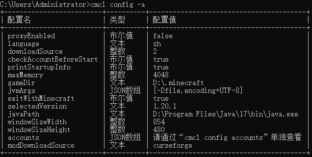

# 更新日志
目前的最新版本为2.2，发布日期是2023年7月13日。

## 2.2（2023年7月13日）
- 解决了由 [Wst-04d12](https://github.com/Wst-04d12) 于 [Issue#29](https://github.com/MrShieh-X/console-minecraft-launcher/issues/29) 提出的问题，并**支持 1.20 的新功能 Quick Play**，通过设置以下配置使用此功能。

| 配置名             | 类型  | 含义                                                                                                      |
|-----------------|-----|---------------------------------------------------------------------------------------------------------|
| qpLogFile       | 文本  | [**游戏相关**]快速游玩（Quick Play，Minecraft 1.20 的新功能，设置下面三项配置即可启动游戏后分别直接进入存档、服务器、领域，只能设置一项）的日志文件路径（相对于游戏目录），可选 |
| qpSaveName      | 文本  | [**游戏相关**]快速游玩直接进入的存档名称                                                                                 |
| qpServerAddress | 文本  | [**游戏相关**]快速游玩直接进入的服务器地址（包括端口），该配置也适用于1.20之前的版本                                                         |
| qpRealmsID      | 文本  | [**游戏相关**]快速游玩直接进入的领域ID                                                                                 |

- 显示多个游戏版本、模组加载器版本等时将会**更加直观**，且会**适应命令行窗口大小**，如下图（由 [Dage-Hoo](https://github.com/Dage-Hoo) 于 [Issue#28](https://github.com/MrShieh-X/console-minecraft-launcher/issues/28) 提出）。 
   
- 通过`cmcl account -l`打印账号与通过`cmcl config -a`和`cmcl config -v`打印配置时，将使用**表格的形式打印**，如下图。 
   
- 对于某些可能会经常输入的命令，例如切换下载源`cmcl config downloadSource <下载源>`、开关代理`cmcl config proxyEnabled true/false`，
  可以通过`cmcl simplify -s <简化命令> "<原命令>"`设置简化命令，例如：输入命令`cmcl simplify -s pon "config proxyEnabled true"`后，
  输入命令`cmcl pon`即可快速开启代理。但是要注意，不要与已有的选项和本地版本名冲突。通过`cmcl simplify -h`获取其他用法。结合用户实际使用情况，建议设置以下简化命令：

| 简化命令（可随意设置） | 原命令                       | 含义            | 
|-------------|---------------------------|---------------|
| ds0         | config downloadSource 0   | 设置下载源为官方      |
| ds1         | config downloadSource 1   | 设置下载源为BMCLAPI |
| ds2         | config downloadSource 2   | 设置下载源为MCBBS   |
| pon         | config proxyEnabled true  | 开启代理          |
| poff        | config proxyEnabled false | 关闭代理          |
| als         | account --list            | 列出所有账号        |
| sr          | install --show=r          | 列出所有可安装的正式版   |
| ar          | account -r                | 刷新当前登录账号      |

- 模组与整合包信息中将会带有**图标链接**与**下载量**（由 [Shapaper](https://github.com/Shapaper) 于 [Issue#33](https://github.com/MrShieh-X/console-minecraft-launcher/issues/33) 提出）。
- 下载模组和整合包时，如果mods目录内已有同名文件，将会询问是否覆盖目标文件、存储到其他目录或取消下载。
- 修复了**无法启动某些版本**的问题。
- 把“字符串”字样修改成了“文本”。

## 2.1.4（2023年5月21日）
- 可通过设置配置`proxyEnabled`为`true`或`false`开关代理，网络出错时若检测到开启了代理则会提示用户确认代理是否可用。
- 多线程下载文件（资源文件、整合包的模组文件）将会在单个文件下载成功后才输出其日志，且会显示已下载文件的数量和要下载的文件总数量。
- 更改了模组下载源的选择方式。

## 2.1.3（2023年4月1日）
- 修复了一些问题。

## 2.1.2（2023年4月1日）
- 解决了由 [Butterblock233](https://github.com/Butterblock233) 于 [Issue#26](https://github.com/MrShieh-X/console-minecraft-launcher/issues/26) 提出的问题。

## 2.1.1（2023年2月26日）
- 可在安装 Fabric API 的选项`--api`后面指定版本。
- 增强了对其他启动器安装的版本的兼容性。
- 修复了无法通过`cmcl -p`打印启动命令的问题。
- 与 Linux 一样，在 macOS 中，将默认读取`~/.config/cmcl/cmcl.json`作为配置文件。
- 在 Linux 与 macOS 下，CMCL的工作目录由CMCL所在目录下的`.cmcl`文件夹转到用户目录下的`.cmcl`文件夹。

## 2.1（2023年2月12日）
- 优化了启动器的启动速度。
- 与版本相关的操作（version）后面可以不接版本以操作已选择版本，如`cmcl version --fabric --api`。
- 可通过`version [<版本>] --isolate`与`version [<版本>] --unset-isolate`设置与取消设置版本隔离。
- 可通过`version [<版本>] -p`或`version [<版本>] --print-command`打印版本的启动命令。
- 可通过`version [<版本>] --export-script=<脚本文件>`导出启动脚本，通过`version [<版本>] --export-script-ps=<脚本文件>`导出 PowerShell 格式的启动脚本。
- 原打印启动命令的选项`-p`与`--print`后面可不加上版本，意为打印已选择版本的启动命令。
### 由 [Jaffe2718](https://github.com/Jaffe2718) 于 [Issue#25](https://github.com/MrShieh-X/console-minecraft-launcher/issues/25) 提出的新特性
- 帮助文档更加整洁。
- 将会自动安装前置模组。
- 安装模组与整合包时可以不指定下载源，首次下载时会询问并保存到本地供下次使用。
- 可通过`cmcl mod --url=<模组地址>`与`cmcl modpack --url=<整合包地址> [--storage=<版本存储名称>]`从互联网下载模组、下载与安装整合包。
- 安装模组与整合包时，可通过`--game-version=<游戏版本>`指定游戏版本，通过`-v, --version=<模组版本>`指定模组或整合包的版本。因 CurseForge 中某些模组或整合包的版本名称不存在于文件名中，所以对于他们，并不能正确地找到相应的模组或整合包，此功能可能会无济于事，甚至会匹配错误。

## 2.0.1（2023年1月20日）
- 修复了一些问题。

## 2.0（2023年1月18日）
- 为了使命令符合规范，本版本对各个功能的操作命令进行了大改动，具体内容请查看[帮助文档](README.md#-帮助文档)，也可以查看[视频教程](https://www.bilibili.com/video/BV1bY411R7wa/)。
- 支持统一通行证登录，使用`account -h` 获取相关信息。
- 添加了新的界面语言：粤语（简体）。可通过`config language cantonese`切换。
- 支持启动游戏时打印启动信息（如Java 路径、最大内存、登录的账号等），可通过`config printStartupInfo true/false`开启或关闭。
- 修复了 CurseForge 整合包的某些文件无法下载的问题。
- 安装 Forge、Fabric 等时不输入版本按回车则选择最新版本。
- 可在版本安装命令后面加上`-s`或`--select`表示安装后选择该版本。
- 数据文件目录更改为`.cmcl`

## 1.8（2022年11月11日）
- 若独立版本配置的 Java 路径、最大内存以及窗口宽高设置得不符合规范，将会自动使用全局配置值并且提示。
- 将下载资源文件的步骤调整至最后，避免下载时卡住而无法继续安装版本。
- 在 Linux 中，将默认读取`~/.config/cmcl/cmcl.json`作为配置文件（由 [Just-A-Pony](https://github.com/Just-A-Pony) 于 [Issue#18](https://github.com/MrShieh-X/console-minecraft-launcher/issues/18) 提出）。

## 1.7（2022年9月12日）
- 可通过`-config -view`查看所有可修改的配置。
- 可通过`-vcfg <版本名称> <配置名称，使用“-config -view”查看的内容中带有“[游戏相关]”的> <内容，有空格则加上双引号，不输入则使用全局配置>`此通用命令设置版本配置（带有“[游戏相关]”的配置兼容HMCL）。
- 可在自定义游戏参数或JVM参数命令后面添上`-version <版本名称>`以指定要设置的版本。

## 1.6（2022年8月26日）
- 可在安装版本后或安装版本时**安装 Fabric API**，需在**安装命令后加上**`-fapi`。例`-version -f 1.19 -fapi`或`-install 1.19 -f -fapi`（由 [BlockyDeer](https://github.com/BlockyDeer) 于 [Issue#17](https://github.com/MrShieh-X/console-minecraft-launcher/issues/17) 提出）。
- 加快了本程序启动速度。
- 解决了无法从 Modrinth 安装某些模组或整合包的问题。

## 1.5.2（2022年8月16日）
- 如果没选择版本直接双击启动，则会显示提示语，指导使用（对小白友好）。
- 增强了 Java 路径的识别兼容性，即便路径设置在`bin`目录或 Java 根目录也能识别。

## 1.5.1（2022年8月7日）
- 可以通过`-cfu`检查更新。

## 1.5（2022年8月7日）
- 首次下载文件将会询问下载源。
- 启动游戏时如果没有登录账号将会要求用户马上登录。
- 区分了不同架构的原生依赖库（natives）目录。

## 1.4.1（2022年7月21日）
- 可以通过`-vcfg <版本名称> -workingDirectory <目标目录，不输入则设为默认>`设置版本隔离。

## 1.4（2022年6月17日）
- **支持安装 Quilt**（可能需要梯子）： 
  1.安装版本时安装 Quilt：在安装命令后面加入“-q”，如：`-install 1.19 -q` 
  2.安装版本后安装 Quilt：`-version -q <目标版本名称>`
- 安装版本后安装模组加载器或 OptiFine，**可在安装命令添加“-v <版本>”以指定要安装的版本**，以免输入命令后再选择版本。例如：`-version -f 1.19 -v 0.14.8`，意为：给名为“1.19”的本地版本安装 Fabric 0.14.8； 
 安装版本时，**可在参数（-f、-o、-e、-p、-q）后面输入版本以指定要安装的版本**。例如：`-install 1.19 -f 0.14.8`，意为：安装版本 1.19 时 顺便安装 Fabric 0.14.8（由 [YhnSoft](https://github.com/YhnSoft) 于 [Issue#15](https://github.com/MrShieh-X/console-minecraft-launcher/issues/15) 提出）。
- **解决了无法启动 OptiFine 与 Forge 共存的低于 1.13（不包括1.13）和安装了 Forge 的 1.19 版本的问题**。
- 适应的 Mojang 的新下载 API，**解决某些无法安装版本的问题**。

## 1.3（2022年6月12日）
- **支持安装 LiteLoader：** 
  1.安装版本时安装 LiteLoader：在安装命令后面加入“-e”，如：`-install 1.18.2 -e` 
  2.安装版本后安装 LiteLoader：`-version -e <目标版本名称>`
- **支持安装 OptiFine：** 
  1.安装版本时安装 OptiFine：在安装命令后面加入“-p”，如：`-install 1.18.2 -p` 
  2.安装版本后安装 OptiFine：`-version -p <目标版本名称>` 
  **注：LiteLoader 和 Fabric、OptiFine 和 Fabric 不能共存**
- 修复了**无法启动** 1.19 的问题。
- 支持**通过 Modrinth 搜索模组和整合包**，具体使用方法请查看使用手册。
- 支持导入 **MultiMC 和 Modrinth 的整合包**。
- 适配了 CurseForge 的新 API，解决了**无法搜索、下载、安装模组和整合包**的问题。
- 支持**启动通过 Forge、Fabric 和 LiteLoader 安装器安装后的版本**，启动前需要通过`-version -b <版本名称>`以补全版本。
- 启动游戏时将不会加载重复的依赖库，优先加载版本较高的那个（暂时只能判断纯数字的且以“.”分割的版本），可**解决某些无法启动的问题**。
- 添加了**沉浸模式的退出命令**`exit`。
- 多线程下载文件（安装整合包时下载模组、安装版本时下载资源）时如果文件下载失败将会尝试重新下载，**提高了多线程下载文件的成功率**。
- 解决了使用下载源 BMCLAPI 和 MCBBS **无法下载 Fabric 的问题**。

## 1.2（2022年4月30日）
- **支持安装 Forge：** 
  1.安装版本时安装 Forge：在安装命令后面加入“-o”，如：`-install 1.18.2 -o` 
  2.安装版本后安装 Forge：`-version -o <目标版本名称>`
- **支持下载并安装整合包**（下载源：CurseForge）： 
  1.搜索整合包并安装（通过名称）：`-modpack -i <整合包名称> -k(可选，安装完成后保留文件)` 
  2.搜索整合包并安装（通过ID）：`-modpack -i -c <整合包ID> -k(可选，安装完成后保留文件)` 
  3.搜索整合包并显示信息（通过名称）：`-modpack -s <整合包名称>` 
  4.搜索整合包并显示信息（通过ID）：`-modpack -s -c <整合包ID>` 
  5.安装本地 CurseForge 整合包：`-modpack -l <整合包路径>`
- 可**通过模组ID找到目标模组**，用法： 
  1.搜索模组并安装（通过ID）：`-mod -i -c <模组ID>` 
  2.搜索模组并显示信息（通过ID）：`-mod -s -c <模组ID>`
- 安装模组时将会提示要安装的**前置 Mod**。
- 修复了某些代理设置问题。
- 改变了关于信息的输出格式。
- 修复了 22w16a 及更新版本**无法下载原生依赖库文件**的问题（由 [Wst-04d12](https://github.com/Wst-04d12) 提出）。
- 登录**外置账号的“-d”可省略**，即`-account -l -a <服务器地址> -s(可选，登录成功后选择此账号)`
- 修复了一些问题。
- 修复了无法登录**多角色外置账号**的问题（由 [Yurzi](https://github.com/Yurzi) 提出），将会询问需要登录哪个角色。
- 修复了搜索 Mod 时会显示非 Mod 的游戏组件。
- 添加了**沉浸模式**，可通过`-i`或`-immersive`进入。

## 1.1（2022年3月27日）
- 支持安装 Fabric： 
  1.安装版本时安装 Fabric：在安装命令后面加入“-f”，如：`-install 1.18.2 -f` 
  2.安装版本后安装 Fabric：`-version -f <目标版本名称>`
- 支持安装模组（CurseForge）： 
  1.搜索模组并安装：`-mod -i <模组名称>` 
  2.搜索模组并显示信息：`-mod -s <模组名称>`
- 支持登录外置账号，使用参数：`-account -l -a -d <服务器地址> -s(可选，登录成功后选择此账号)`
- 支持多账号登录，详情用法请参阅[使用手册账号相关](README.md#账号相关)。如果已经登录了的用户，务必重新登录。
- 支持离线账号自定义皮肤和披风： 
  设置皮肤：`-account -s -u <皮肤文件路径(不输入则为取消设置皮肤)>` 
  设置皮肤为 Steve：`-account -s -e` 
  设置皮肤为 Alex：`-account -s -x` 
  设置披风：`-account -c <披风文件路径，如果不输入则为取消设置披风>`
- 支持设置代理，代理信息以配置作为存储方式存储。代理配置：

| 配置名           | 类型  | 含义               |
|---------------|-----|------------------|
| proxyHost     | 字符串 | 主机地址（如果为空则不设置代理） |
| proxyPort     | 整数  | 端口               |
| proxyUsername | 字符串 | 代理验证的账户（可选）      |
| proxyPassword | 字符串 | 代理验证的密码（可选）      |

- 支持查看已安装的版本信息：`-version -i <版本名称>`
- 支持打印配置文件原内容，参数：`-config -o <缩进的空格数，可为空，默认为2>`
- 支持自定义JVM虚拟机和游戏参数，详情用法请查阅[配置](README.md#%E9%85%8D%E7%BD%AE)。
- 添加了更多下载源，修改下载源：`-config downloadSource <目标下载源，0为默认，1为BMCLAPI，2为MCBBS>`。注意，如果无法下载文件请尝试更换下载源。
- 添加了更改配置的新方式（不分类型，按字符串储存，布尔值或整数能正常读取）：`-config <配置名称> <配置值>`
- 更改了打印全部配置的显示。
- 更改了默认资源下载线程数为64。
- 安装版本时，存储的版本名称可为空，默认为要安装的版本名称。如：`-install 1.18.2`，则默认存储为“1.18.2”
- 如果最大内存为空，将会自动分配内存。
- 修复了不下载资源文件就不会下载依赖库文件的问题。

## 1.0（2022年3月12日）
- 第一个版本。